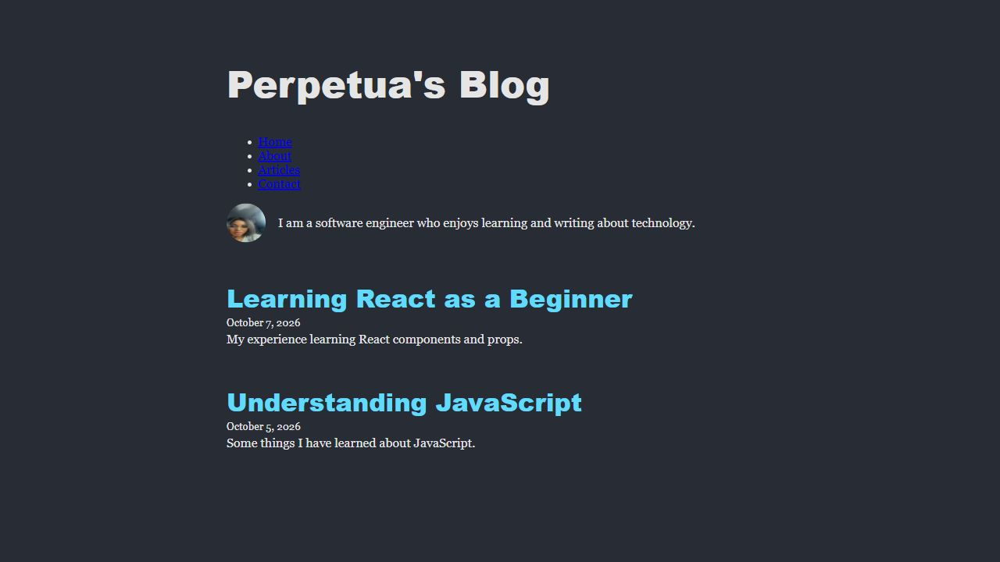
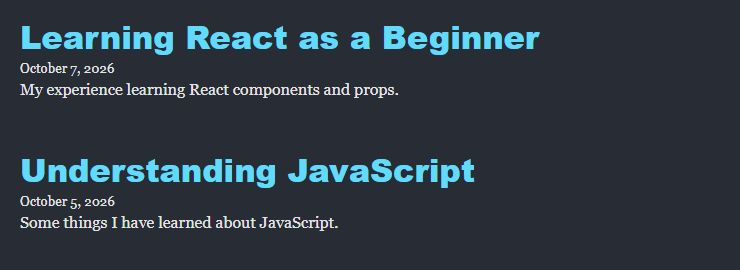

# Perpetua's Blog

A simple React blog with a profile, navigation, and article previews.

## Run the Project

You need Node.js and npm. In your Ubuntu or VS Code WSL terminal, run:

```bash
cd ~/Flatiron/reactlesson/react-components-props-vite-lab
npm install
npm run dev
```

Open the address shown in the terminal, usually `http://localhost:5173/`.
Press `Ctrl+C` to stop the server.

## Tests and Build

- Run tests: `npm test -- --run`
- Create a production build: `npm run build`
- Preview the build: `npm run preview`

## Components

- **App:** Reads `Blog.js` and connects Header, About, and ArticleList.
- **Header:** Gets the blog name from App and displays navigation links.
- **About:** Gets the profile image and biography from App. Uses a placeholder if no image is provided.
- **ArticleList:** Gets posts from App and creates an Article for each post.
- **Article:** Gets a title, date, and preview from ArticleList. Uses January 1, 1970 if no date is provided.
- **Contact:** Displays social links from a supplied blog object. It is currently left out of App, so the Contact navigation link has no section to open.

Edit `src/components/Blog.js` to change the blog name, image, biography, or posts.
App is the home page, and Contact contains the external links; there are no separate Home or Links components.

## Screenshots

### Blog



### Articles


